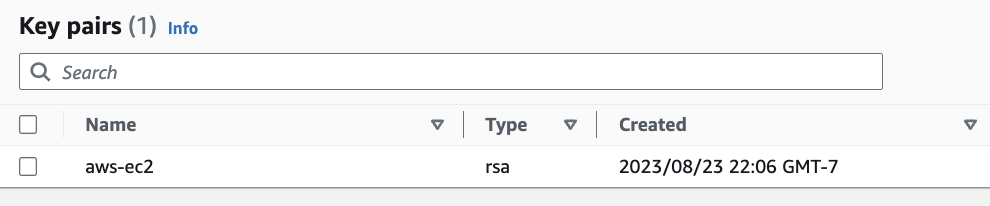

## Introduction

This  assignment aims to set up an AWS EC2 instance with the specified configurations. The assignment provides modularity through the use of variables, making it flexible and customizable according to user needs.

## Prerequisites

1. Install [Terraform](https://learn.hashicorp.com/tutorials/terraform/install-cli).
2. Install and configure [AWS CLI](https://aws.amazon.com/cli/).

## Setup & Deployment

### 1. GitHub Repository:

```bash
git clone git@github.com:sirishacyd/terraform-aws-ec2.git
cd terraform-aws-ec2
```
### 2. Configuration files:

- **main.tf**: Contains the primary AWS resources configurations, including the EC2 instance setup.
  - [View main.tf](https://github.com/sirishacyd/terraform-aws-ec2/blob/main/main.tf)
  
- **variables.tf**: Declares the variables used across configurations, making it modular and flexible for changes.
  - [View variables.tf](https://github.com/sirishacyd/terraform-aws-ec2/blob/main/variables.tf)

- **output.tf**: Defines the outputs (in this case, the public DNS of the EC2 instance) post Terraform apply.
  - [View output.tf](https://github.com/sirishacyd/terraform-aws-ec2/blob/main/output.tf)

- **terrafrorm.tfvars**: Setup Variable in the tfvars file based on environment you need the instance in.
  - [View output.tf](https://github.com/sirishacyd/terraform-aws-ec2/blob/main/terraform.tfvars)

### 3. Configure AWS Credentials& Key pair:

Ensure you have set up your AWS credentials using the AWS CLI:

```bash
aws configure
AWS Access Key ID : 
AWS Secret Access Key: 
Default region name : 
Default output format:
```

- **Create an AWS Key Pair**:
This key pair will be used to securely connect to instances created by Terraform.



### 4. Setup Variable in the tfvars file based on environment you need the instance in with the below mentioned details


```bash
aws_region = "us-east-2"
instance_type = "t2.micro"
subnet_id = "subnet-0440f16816f0aaae5"
key_name = "aws-ec2"
ami_id   = "ami-0ccabb5f82d4c9af5"
tags = {
  "Name"    = "my-custom-terraform-instance"
  "Project" = "Demo"
}
```
- **terrafrorm.tfvars**: Setup Variable in the tfvars file based on environment you need the instance in.
  - [View output.tf](https://github.com/sirishacyd/terraform-aws-ec2/blob/main/terraform.tfvars)
  
### 5. Initialize Terraform:

```bash
terraform init
```

  
### 6. Review the Terraform Plan:

Inspect the resources that Terraform plans to create/modify:

```bash
terraform plan
```
 
 
### 7. Apply the Configuration:

Execute the Terraform configuration to create the AWS resource:

```bash
terraform apply
```
 
### 8. Outputs:

After the successful application of the configuration, Terraform will display the public DNS of the created EC2 instance.


## 9.Cleanup:

Destroy the Terraform-managed resources when done:

```bash
terraform destroy
```


