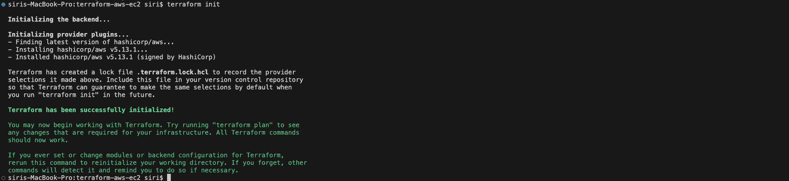
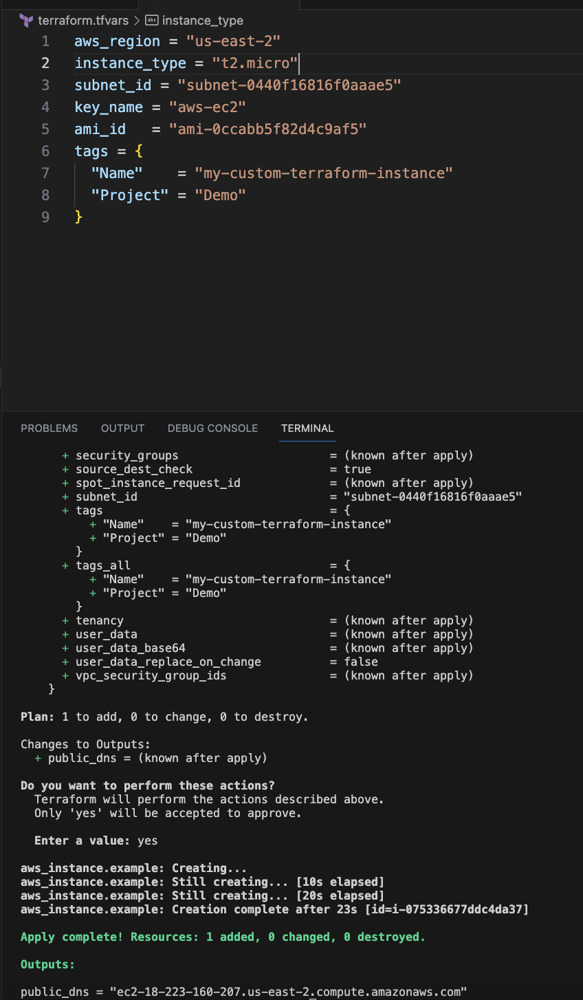
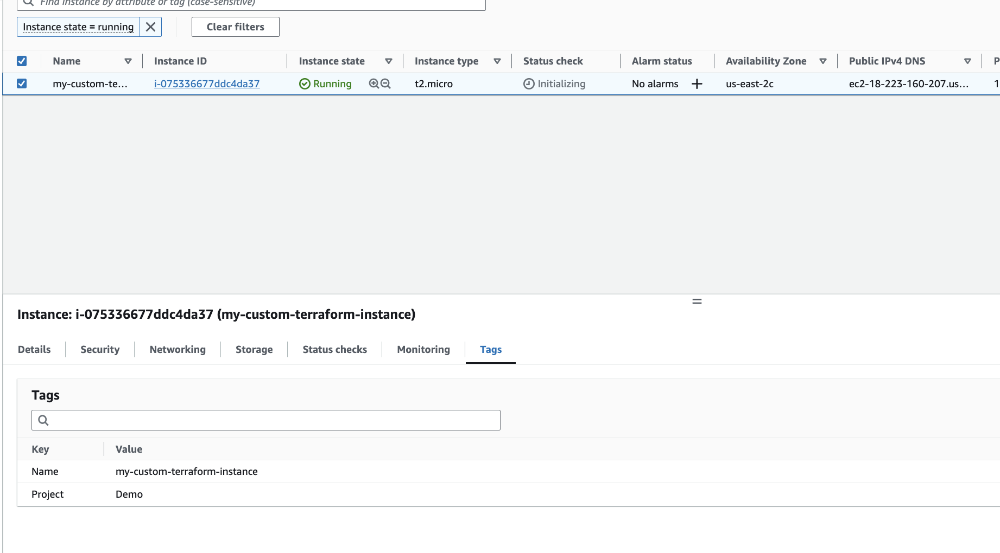
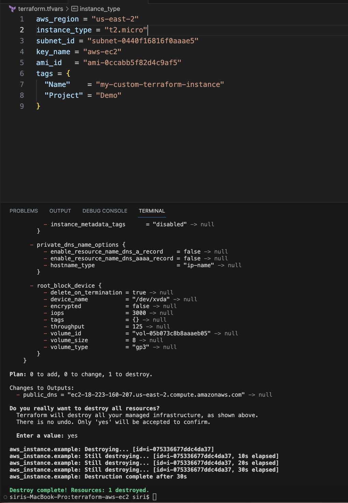

# Terraform AWS EC2 Setup
## Prerequisites

1. Install [Terraform](https://learn.hashicorp.com/tutorials/terraform/install-cli).
2. Install and configure [AWS CLI](https://aws.amazon.com/cli/).

## Setup & Deployment

### 1. GitHub Repository:

```bash
git clone git@github.com:sirishacyd/terraform-aws-ec2.git
cd terraform-aws-ec2
```
### 2. Configuration files:

- **main.tf**: Contains the primary AWS resources configurations, including the EC2 instance setup.
  - [View main.tf](https://github.com/sirishacyd/terraform-aws-ec2/blob/main/main.tf)
  
- **variables.tf**: Declares the variables used across configurations, making it modular and flexible for changes.
  - [View variables.tf](https://github.com/sirishacyd/terraform-aws-ec2/blob/main/variables.tf)

- **output.tf**: Defines the outputs (in this case, the public DNS of the EC2 instance) post Terraform apply.
  - [View output.tf](https://github.com/sirishacyd/terraform-aws-ec2/blob/main/output.tf)


### 2. Configure AWS Credentials:

Ensure you have set up your AWS credentials using the AWS CLI:

```bash
aws configure
AWS Access Key ID : 
AWS Secret Access Key: 
Default region name : 
Default output format:
```


### 3. Initialize Terraform:

```bash
terraform init
```

  
### 4. Review the Terraform Plan:

Inspect the resources that Terraform plans to create/modify:

```bash
terraform plan
```
 
 
### 5. Apply the Configuration:

Execute the Terraform configuration to create the AWS resource:

```bash
terraform apply
```
 
### 6. Outputs:

After the successful application of the configuration, Terraform will display the public DNS of the created EC2 instance.

 



## Cleanup:

To avoid ongoing AWS charges, destroy the Terraform-managed resources when done:

```bash
terraform destroy
```


